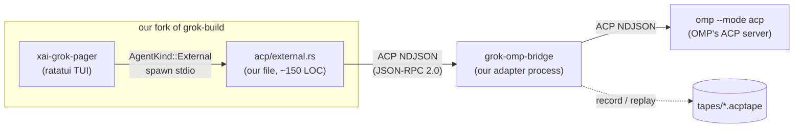

# SPEC — Grok Build TUI driven by the OMP agent

Status: draft for execution
Owner: firatoezcan
Created: 2026-09-10
Upstream baseline: `xai-org/grok-build`, clone `SOURCE_REV = c4ea71cfdbcdb21e32e41bc25a0043d7d4836714`
Agent under test: `@oh-my-pi/pi-coding-agent@18.1.17` (binary `omp`)

---

## 0. Goal

Run **Grok Build's fullscreen, mouse-interactive TUI** with **OMP as the agent brain**, in a fork of Grok Build that stays cheap to re-sync with upstream.

Concretely:

1. The Grok pager renders OMP sessions — streaming text, thinking, tool calls with diffs, permissions, plans.
2. The fork's diff against upstream stays tiny (target: **1 new file we own + ~12 added lines across ≤5 upstream files**), so upstream snapshots can be pulled regularly without hand-merging.
3. Everything the pager requires from x.ai (login, telemetry, entitlement, update checks, leader daemon) is neutralized — preferring **zero-diff config switches** over code edits.
4. The ACP wire between pager and agent is **tappable**: real sessions are recorded as fixtures and replayed deterministically in tests, with no OMP and no network.

### Non-goals

- Reimplementing or patching Grok's private feature panels (workflows, goals, background tasks, hooks UI, memory UI, subagent panes). They stay dark. See §7.4.
- Upstreaming anything. `CONTRIBUTING.md` states the repo does **not** accept external contributions.
- Supporting Windows. termctrl persistent sessions are macOS/Linux only; Grok's Windows path is best-effort upstream.
- Replacing Grok's own tools with OMP's, or vice versa. OMP keeps its 28 tools and executes them in-process.

---

## 1. Why this works (evidence)

| Fact | Evidence |
|---|---|
| The pager is a **pure ACP client**; its only link to the agent is one channel pair | `xai-acp-lib/src/channel.rs:22` `AcpChannel<AcpClientMessage, AcpAgentMessage>` |
| Transport taxonomy is exactly two variants, both converging on one init path | `xai-grok-pager/src/acp/mod.rs:64-71` (`AgentLocation::{Thread, Leader}`), `acp/mod.rs:223` (`initialize_connection`) |
| The ACP→transport bridging code is **already transport-generic** | `acp/leader_bridge.rs:89` `bridge_channels()` takes two `mpsc<String>` JSON-line channels; only the optional `LeaderReconnector` is leader-specific |
| Upstream deliberately deferred subprocess agents | `acp/spawn.rs:1-5` — *"Subprocess and remote modes can be added later if needed"* |
| Agent→TUI ingress is a single site | `app/event_loop.rs:2656-2660` → `acp_handler::handle(msg, &mut app)` |
| **Protocol versions already match** | OMP: `@oh-my-pi/pi-utils/src/acp/protocol.ts:13` `PROTOCOL_VERSION = 1`; Grok: `Cargo.toml:117` `agent-client-protocol = "0.10.4"` → `acp::ProtocolVersion::V1` |
| OMP ships a full ACP server | `omp acp` (`src/commands/acp.ts`) → `runAcpMode` (`src/modes/acp/acp-mode.ts`) → `AcpAgent` (`acp-agent.ts`, 2823 lines) |
| ACP here is JSON-RPC 2.0 over NDJSON; the only `.proto` in the tree is an unrelated gRPC tools service | `crates/codegen/xai-grok-tools-api/proto/grok-tools.proto` |

**Consequence:** this is not a renderer port. It is a transport hook plus a payload-fidelity backlog.

---

## 2. Architecture



Three separable pieces — this separation *is* the plan:

| Piece | Lives in | Owns |
|---|---|---|
| **Transport hook** | our fork, `acp/external.rs` + ~12 hook lines | spawning a child, turning its stdio into ACP channels, handing it to `initialize_connection` |
| **Adapter** | `bridge/` (Bun/TS, or Rust) | capability hygiene, `_meta` injection, Grok-shaped `raw_input` variants, **recording/replay** |
| **Brain** | upstream OMP, unmodified | agent loop, tools, sessions, models |

The adapter exists because OMP's ACP server is *almost* right (§7.3). It can be bypassed entirely by pointing the transport hook straight at `omp acp` — useful for the earliest smoke test, but the fidelity work and all replay machinery live in the adapter.

---

## 3. Guiding principles

- **P1 — Additive-only fork.** Our changes are a new file plus one-line hooks that delegate into it. No upstream file gets rewritten; no upstream function body gets restructured beyond an early-return guard.
- **P2 — Zero-diff before any diff.** De-branding first tries existing config/env switches. Code edits are the last resort (§8).
- **P3 — One seam per concern.** Transport in the fork; policy in the adapter; agent behavior in OMP. Nothing crosses.
- **P4 — Tap everything.** Every ACP frame is recordable and replayable, so tests never need a live model.
- **P5 — Merge-friendliness is a testable property.** A CI script asserts that our diff surface equals the allowlist in §6. Drift is caught automatically, not discovered during a merge.

---

## 4. Staged plan

The user-facing ordering is deliberate: **boundary separated → ACP proven → external AgentKind → wired together**.

### Stage 0 — Fork, build, environment, de-brand

**Deliverables**

1. Fork layout (§9.1) with `upstream` remote tracked.
2. Toolchain installed on this machine (currently **absent**: no `rustc`/`cargo`/`rustup`/`dotslash`/`protoc`/`zig`).
   - Rust `1.94.0` (pinned by `rust-toolchain.toml`), `dotslash` (required for hermetic `bin/protoc`), `protoc` via dotslash or `$PROTOC`.
   - Choose one: `rustup` (simplest; `~/.cargo` does not exist yet) or the nix-darwin flake. `brew` is also present.
3. `cargo run -p xai-grok-pager-bin` reaches the welcome screen offline.
4. De-brand config shipped as a wrapper (§8.1) — **zero source diff**.
5. `cfg`/env wrapper script `scripts/run-omp-grok.sh` that exports the §8.1 environment.

**Definition of done:** the forked binary boots to the welcome screen with **no login screen, no leader process, and zero outbound connections** (verified by the §10.5 egress gate).

---

### Stage 1 — ACP proven, pager untouched

Goal: prove `omp --mode acp` speaks the subset the pager needs, and build the tape machinery — **without touching the fork at all**.

**Deliverables**

1. A scripted ACP client (Bun) that drives `omp acp`: `initialize` → `session/new` → `session/prompt` → assert streaming `session/update` → `cancel`.
   - Assert on: text chunks, thinking chunks, tool call start/update/end, `ToolKind` values, diff content, permission requests, plan updates.
2. **Tape recorder**: a transparent NDJSON proxy that sits between client and agent and writes `.acptape` (§10.2). This is the "protocol tap" and it must exist *before* the fork changes, so ground truth is captured from a stock configuration.
3. A golden tape set covering: plain answer, thinking-only turn, `edit` with diff, `bash` with output, permission prompt, cancel mid-stream.
4. Written answer to **OMP capability questions** (§7.3): does OMP advertise `fs`/`terminal` client capabilities, and does it delegate? If yes, the recorder must strip them.

**Definition of done:** tapes exist; replaying a tape through a stub server produces byte-identical `to_client` frames (`--selfcheck`); the OMP behaviour matrix in §7.3 is filled in with real observations, not source reading.

**No fork edits in this stage.**

---

### Stage 2 — Boundary separated: `AgentKind::External` over stdio

Land the transport hook as a **first-class backend**, not a hidden escape hatch.

```
crates/codegen/xai-grok-pager/src/acp/external.rs               (new file, ours, ~150 LOC)
crates/codegen/xai-grok-pager/src/acp/mod.rs                    +1 line: `pub mod external;`
crates/codegen/xai-grok-telemetry/src/startup.rs                +1 variant `External,`
crates/codegen/xai-grok-pager/src/app/startup_failure/render.rs +1 match arm
crates/codegen/xai-grok-pager/src/app/mod.rs                    ~5 lines in the connect dispatch
crates/codegen/xai-grok-pager/src/app/cli.rs                    +1 flag `--agent-command` (after :432)
```

`--agent-command <PROGRAM>` selects the backend and supplies the child command; `AgentKind::External` is the resolved kind, so the backend shows up correctly in startup-failure rendering and telemetry labels.

**Test affordance, not a second seam:** `external.rs` also honours a `GROK_ACP_BACKEND_CMD` environment override, because the L2/L3 harnesses (§10.4) need to inject a replay agent without threading a CLI flag through the PTY harness. This is a debug path only — the supported way in is the flag.

**Required before editing:** enumerate **every** match on `AgentKind` across the tree (`grep -rn "AgentKind" --include=*.rs`) and confirm the complete list is `xai-grok-telemetry/src/startup.rs`, `app/startup_failure/render.rs`, `app/mod.rs`, and `headless.rs`. Two investigations located the enum by different routes; exhaustive enumeration is a task, not an assumption.

**Reference backends for this stage** (prove the seam without OMP):
- `grok agent stdio` — upstream's own ACP server, an independent conformance target.
- our replay agent (§10.3a) — deterministic, no model, no network.

**Definition of done:** with `--agent-command` set to the replay agent, the TUI renders a recorded session end to end; with it unset, behaviour is byte-identical to upstream.

---

### Stage 3 — Wire OMP in

Point the seam at the adapter, which spawns `omp acp`.

**Deliverables**

1. Adapter process (`bridge/`) — NDJSON proxy with:
   - **capability hygiene**: rewrite the client's `initialize` capabilities so OMP does not delegate `fs`/`terminal` to a pager that silently drops those methods (§7.3);
   - **`_meta` injection**: `_meta["x.ai/tool"]` = `CanonicalToolMeta` v1 on tool calls;
   - **kind precision**: override OMP's `ToolKind` where Grok's dispatch needs a specific value;
   - **`raw_input.variant` shaping** for the tools with no kind-driven path;
   - **tape recording** of every session (already built in Stage 1).
2. First live end-to-end run: real model, real prompt, rendered in the Grok TUI.
3. Fidelity matrix filled in from observation (§7.4).

**Definition of done:** text, thinking, tool rows, diffs, permission prompts and plan updates all render; the fidelity gap list is measured rather than predicted.

---

### Stage 4 — Fidelity backlog and sync cadence

Work the §7.4 table in order. Establish the upstream sync ritual (§5.3) and run it once on a newer snapshot to prove it is cheap.

---

## 5. Fork and merge strategy

### 5.1 The problem

Upstream's history is a **series of squashed monorepo snapshots** — 44 commits, every one titled `Synced from monorepo`, with a `SOURCE_REV` file recording the monorepo SHA of the current tree. There are no release tags and no meaningful intermediate history, so blame and bisect are useless against it. A normal `git merge upstream/main` does work; the discipline below exists so that merge stays a non-event.

The root `Cargo.toml` is **generated** and explicitly documented as read-only.

### 5.2 The model

Treat upstream as **snapshots**, and our work as a **patch series plus additive files**:

```
grok-build/                       # our fork
├── upstream/                     # remote tracking xai-org/grok-build
├── HEAD                          # our commits on top of an upstream snapshot
├── crates/codegen/xai-grok-pager/src/acp/external.rs     # ours, new path
├── bridge/                       # ours
└── scripts/
    └── check-drift.sh            # CI gate: our diff surface == allowlist (§6)
```

The §6 intervention table is the manifest; `scripts/check-drift.sh` enforces it and fails
on a file outside the allowlist or a hook file over its line budget.

Rules:
- **Never touch the generated root `Cargo.toml`.**
- **Never restructure an upstream function.** Hooks are early-return guards or single statements at stable positions.
- New files live at paths upstream will never create — collisions are impossible, so they never conflict.
- `AgentKind::External` is the supported backend (2b); the `GROK_ACP_BACKEND_CMD` env override is a test affordance only, so the merge surface never depends on it.
- No `[patch]`/`[replace]` sections.

### 5.3 Sync ritual

```sh
git fetch upstream main
git log --oneline HEAD..upstream/main | head        # what changed
git merge --no-commit upstream/main                 # or: rebase our commits
bash scripts/check-drift.sh                         # our surface must still match the §6 manifest
cargo check -p xai-grok-pager -p xai-grok-pager-bin
```

Because our delta is ~12 added lines across at most five files, a conflict is at most a one-line re-resolution. `check-drift.sh` must fail loudly when upstream moves a hook region, so drift surfaces as a red CI job rather than a surprise merge.

---

## 6. Intervention manifest (the allowlist)

Everything we add or change. Nothing else may differ from upstream.

| # | File | Change | Lines | Drift risk | Stage |
|---|---|---|---|---|---|
| 1 | `xai-grok-pager/src/acp/external.rs` | **new file, ours** (~150 LOC): spawn child (`detach_command` + `pager_env` + `kill_on_drop`), two `mpsc<String>` channels, forwarder tasks, reuse `leader_bridge::bridge_channels(tx, rx, cancel, None, ReconnectPolicy::bounded())`, build `AgentEndpoint { location: AgentLocation::Thread(handle), .. }`, call `initialize_connection` | all | **none** (new path) | 2 |
| 2 | `xai-grok-pager/src/acp/mod.rs` | `pub mod external;` next to `pub mod leader_bridge;` | +1 | low (module list) | 2 |
| 3 | `xai-grok-pager/src/acp/mod.rs` | dispatch arm at the top of `connect()` selecting the external backend ahead of the embedded fallback | +3 | low–medium (4-line body, documented extension point) | 2 |
| 4 | `xai-grok-telemetry/src/startup.rs:155-158` | `+ External,` in `pub enum AgentKind` (serde `snake_case`, additive) | +1 | low | 2 |
| 5 | `xai-grok-pager/src/app/startup_failure/render.rs:182-185` | `+ AgentKind::External => "external agent"` | +1 | low | 2 |
| 6 | `xai-grok-pager/src/app/mod.rs:1010-1047` | ~5 lines: resolve the external command and add one match arm in the connect dispatch | ~5 | medium (busy region) | 2 |
| 7 | `xai-grok-pager/src/app/cli.rs` (after :432) | `--agent-command` value flag, next to `--leader-socket` | +1 | low | 2 |
| — | any `Cargo.toml` | **none** — code lives inside the existing pager lib crate, which already depends on `agent-client-protocol`, `xai-acp-lib`, `xai-grok-shell`, `tokio`, `xai-tty-utils` | 0 | — | — |
| — | root `Cargo.toml` | **never** (generated) | 0 | — | — |

Note: an alternative "separate crate" design was evaluated and rejected — it needs a pager `Cargo.toml` dependency line *and* cannot reach `AgentEndpoint`/`initialize_connection` (both `pub(in crate::acp)`), forcing ~110 lines of duplicated bridge code.

`scripts/check-drift.sh` asserts that every path differing from `upstream/main` is either one of the
files #1–#7, an owned path (`bridge/`, `tapes/`, `scripts/`, `SPEC.md`), or the new `acp/external.rs`,
and that the hook files stay inside their line budget. It currently reports `+18/-1` against a budget of 40.

---

## 7. ACP contract

### 7.1 What the pager requires (minimum backend surface)

| Area | Required | Notes |
|---|---|---|
| `initialize` | yes | Consumed: `authMethods`, `meta.modelState`, `meta.availableCommands`, `meta.grokShell`, `meta.cancelRewind`, `meta.sessionRecap`, `meta.feedbackTraceOffer`, `meta.defaultAuthMethodId`. All optional except `authMethods`/`agentCapabilities` — missing `modelState` → empty ModelState; missing `availableCommands` → `[]` (`acp/mod.rs:468-523`). **Advertise `authMethods: []`** → no login screen (§8.1 A10). |
| `session/new` | yes | must return `sessionId` |
| `session/prompt` | yes | resolves at turn end |
| `session/cancel` | yes | Esc / Ctrl+C |
| `session/update` notifications | yes | renderer reacts to `AgentMessageChunk`, `AgentThoughtChunk`, `ToolCall`, `ToolCallUpdate` (`acp/tracker.rs:966-998`); also consumes `Plan`, `UserMessageChunk`, `CurrentModeUpdate`, `AvailableCommandsUpdate` |
| `session/request_permission` | agent→client | handled at `acp_handler/permissions.rs`; bypassable via `_meta.yoloMode` |
| `session/load`/`resume`/`fork`, `set_mode`, `set_model` | optional | session picker, `/resume`, rewind, plan mode, `/model` |
| ext methods `x.ai/*` | optional | unknown ones are acked and ignored (`acp_handler/mod.rs:457-461`) |

### 7.2 What OMP provides

- **Full v1 agent method set**: `initialize`, `authenticate`, `session/new|load|list|resume|fork|close|set_mode|set_config_option|prompt|cancel` + one ext method.
- **8 of 9 `SessionUpdate` variants** (no live `user_message_chunk`; that appears only on load/resume replay).
- **`ToolKind` mapping** — `mapToolKind` (`acp-event-mapper.ts:182`).
- **`diff` ToolCallContent** — `extractDiffToolCallContent` / `buildDiffContent` (`acp-event-mapper.ts:728-767`) emits per-file old/new text, which is exactly Grok's fallback path in `extract_edit_hunks`.
- **`session/request_permission`** for bash/edit/delete/move (`session/acp-permission-gate.ts`, `session/session-tools.ts` ~:709-800).
- **Launch**: `omp acp` (subcommand), or `omp --mode acp`.

### 7.3 Landmines

1. **Client delegation.** ✅ **Resolved by the adapter, measured with a control group (2026-09-11).** OMP calls `fs/read_text_file`, `fs/write_text_file` and `terminal/*` **when the client advertises those capabilities** (`src/session/client-bridge.ts:31-33` gates each bridge method on exactly that). The Grok pager advertises `terminal` but its `acp_handler` handles only five variants and swallows the rest with `_ => false` (`acp_handler/mod.rs:468`), dropping `response_tx` → the agent's request fails.
   - Evidence (`bridge/drive.mjs`, one recorded turn: read + bash): with the hostile capability set advertised and hygiene **off**, the agent delegated `fs/read_text_file` + `terminal/{create,wait_for_exit,output,release}` twice, ran 5 tool calls instead of 2, and its bash tool reported an internal error while the read came back empty — the client's answer, not the file. With hygiene **on**: zero delegations, 2 tool calls, a clean turn. 588 frames vs 59.
   - The adapter deletes `fs`, `terminal` and `auth.terminal` from the client's `initialize` capabilities. Dropping `auth.terminal` also removes OMP's terminal auth method, leaving the single non-interactive `agent` method that §8.2a requires. Do not rely on OMP-side config for this.
2. **No `_meta` on `initialize`.** `meta.modelState` / `meta.availableCommands` are absent; OMP carries models in `session/new.configOptions`. The pager degrades gracefully, but `/model` and command autocomplete stay empty — see §7.4 for why the adapter does **not** synthesize them.
3. **No `_meta["x.ai/tool"]` on tool calls.** ✅ Injected by the adapter. Grok's exact-identity decode (`tool_taxonomy.rs:186`, strict `version == TOOL_META_VERSION`) needs the envelope; OMP emits nothing, so the adapter stamps `CanonicalToolMeta` v1. Note for anyone chasing render bugs: the **TUI** does not read this key — `tracker.rs` dispatches on `kind`, `title` and `raw_input` — only the headless reducer does (`headless/reducer/mod.rs:201-247`). The stamp is for `grok --headless`, not for the pane.
4. **Frame correlation.** ACP is JSON-RPC 2.0; a rewriting proxy is safe **only if** it preserves `id` values and forwards unrecognised frames verbatim, keeps whole lines (never buffers across lines), and preserves cross-direction interleaving. OMP uses newline-delimited JSON with per-side numeric ids. The adapter honours all four; `createReplay` re-emits recorded frames in `seq` order gated on the client's own progress, so a replayed stream keeps the original interleaving instead of flattening it into "everything on prompt".

### 7.4 Fidelity matrix (measured 2026-09-11, live `omp acp` + adapter + fork TUI)

| Surface | State | Evidence / reason |
|---|---|---|
| Assistant text stream | ✅ | rendered live ("done") |
| Thinking stream | ✅ | 4155 chars of `agent_thought_chunk` in the shapes probe |
| Tool rows: read / execute / search / edit | ✅ by `kind` | OMP's `mapToolKind` already yields `read`/`execute`/`search`/`edit` for the builtins; Grok's tracker dispatches on the same values |
| Whole-file writes | ✅ | `write` → `raw_input.variant = "Write"`; the TUI renders `◆ Creating bridge-probe.txt` instead of an edit row |
| Web search | ✅ | `web_search` → `kind: "search"` + `variant: "WebSearch"`; OMP's native `fetch` would have rendered as a URL fetch |
| Edit diff hunks | ✅ | `ToolCallContent::Diff` from OMP feeds Grok's `extract_edit_hunks` |
| Permission cards | ✅ | `session/request_permission` arrives and is answered |
| Model picker | ⚠️ empty | OMP puts models in `session/new.configOptions` (2 models, one current); `meta.modelState` is absent. **Not synthesized**: `configOptions` is an ACP v2-shaped surface and a wrong translation would silently pin the wrong model. The picker reads "unknown"; `/model` in OMP still works |
| Slash-command autocomplete | ⚠️ empty | no producer at all: OMP never emits `available_commands_update` in a recorded session and rejects `x.ai/commands/list`. Nothing truthful to relay — the adapter relays rather than invents |
| Tool identity (`_meta["x.ai/tool"]` v1) | ✅ | stamped on every classified tool call (headless path; the TUI ignores it — see landmine 3) |
| `todo` / `task` rows | ⚠️ visible as generic rows | deliberately **not** tagged. Grok suppresses `todo_write` and `Task` rows from scrollback and renders them in a todo pane / subagent pane; nothing in OMP feeds those private panes, so tagging would hide the call entirely. A visible row is the better degradation |
| Entitlement probes (`x.ai/billing`, `auth/check_subscription`, `bundle/status`, `marketplace/list`, `prompt_history`, `suggestPrompt`) | ❌ not answered | OMP rejects all nine `x.ai/*` ext methods with `-32603`. **Deliberately not intercepted**: the pager decodes a successful `check_subscription` reply into `xai_grok_login::AuthMeta` and applies it as authoritative (`dispatch/billing.rs:375-395`), so a fabricated empty result would assert an entitlement state rather than report "unknown". Measured benign: in the live run the check failed twice, the gate stayed `gated:false`, and the turn completed. An error while a turn is *pending* does fail that turn — reachable in practice only with sub-millisecond turn latency, which is how the replay lane triggers it |
| `list_dir`, memory, MCP search/use-tool, subagent message | ⚠️ generic `Other` blocks | shaping here would need per-payload Grok shapes; not attempted, and no signature was observed for them in the recorded turns |
| Subagent panes, workflows, goals, background tasks, hooks UI, memory UI, recap, DiffReview, AutoCompact | ❌ | Grok's private `x.ai/session/update` rail (~70 variants) — **no OMP producer at any layer**. Out of scope; panels stay empty |

---

## 8. De-x.ai plan (zero-diff first)

### 8.1 Category A — config/CLI/env only, **no source diff**

Ship these as the fork's default config + wrapper script. Collectively they kill ~90% of the phone-home surface.

| # | Kills | Switch |
|---|---|---|
| A1 | settings fetch, model catalog, announcements, campaign, **all entitlement checks** | `[features] remote_fetch = false` (documented egress master gate; user layer sticks) |
| A2 | product telemetry + Mixpanel | `[features] telemetry = false` (or `GROK_TELEMETRY_ENABLED=false`, `DISABLE_TELEMETRY=1`) |
| A3 | trace upload | `[telemetry] trace_upload = false` |
| A4 | external OTLP | `[telemetry] otel_enabled = false`, `GROK_EXTERNAL_OTEL` unset |
| A5 | Sentry | leave `SENTRY_DSN` unset (public build bakes no DSN) |
| A6 | auto-update | `[cli] auto_update = false` **and** `GROK_DISABLE_AUTOUPDATER=1` |
| A7 | leader auto-spawn (a second phone-home process) | `--no-leader` and `[cli] use_leader = false` (default is already off) |
| A8 | feedback | `[features] feedback = false`, `GROK_FEEDBACK_ENABLED=false` |
| A9 | crash files (local only) | `[diagnostics] crash_handler = false` |
| A10 | **login screen** | **Not achievable by config — see §8.2a.** Pinning `[auth] preferred_method = "api_key"` removes the interactive method (`authMethods: []` observed on the wire, no browser, no device flow), but the pager's `eager_auth_or_login_fallback` *forces* `needs_login = true` when the list is empty, so the welcome screen still renders the `PREFERRED_API_KEY_UNAVAILABLE` card. Auth must be neutralized on the agent side, not the config side. |
| A11 | config isolation | `GROK_HOME=<dir>` |
| A12 | leader socket isolation | `GROK_LEADER_SOCKET` / `--leader-socket` |

### 8.2a Auth is an agent-side concern (measured, not assumed)

The pager's auth state machine, in order:

1. `startup_auth_metadata(auth_methods)` — `needs_login = methods.first().needs_interactive_login()`, `false` for an empty list (`acp/mod.rs:539-568`).
2. `bounded_eager_auth(...)` → `eager_auth_or_login_fallback(...)`, which **overrides step 1**:

```rust
if auth_methods.is_empty() {
    return (true, None, None, AuthStartMode::Pending, None);   // forced login
}
```

3. `event_loop.rs:1368` — `needs_interactive_login = connection.needs_login || force_login`; when true it seeds `AuthState::Pending` and (for an empty list) sets the error copy to the shell's `PREFERRED_API_KEY_UNAVAILABLE` (`auth_method.rs:324`), which the welcome view renders as the "sign in" card.

Consequences:

- **No config switch can suppress it.** An empty method list is treated as a *failed* auth, not as "auth not applicable". The `[auth] preferred_method = "api_key"` pin is still worth keeping (it removes the interactive OAuth method and prevents any browser/device flow), but it is not sufficient.
- **Therefore the backend owns auth.** A backend that advertises at least one **non-interactive** method and answers `authenticate` successfully leaves `needs_login = false`, so the pager never enters the login state at all. That is adapter policy — exactly the §3 P3 split — and needs no additional pager patch.
- OMP's own ACP server has no x.ai credential concept; the adapter needs to confirm what it currently advertises and, if necessary, inject a non-interactive method whose `authenticate` is a no-op success.
- This must be verified with a replay agent (§10.3a) before the first live run, because it is the difference between "boots to a usable prompt" and "boots to a sign-in card".

### 8.2 Category B — the only real hooks

| Item | Where | Intervention |
|---|---|---|
| Version-policy hard exit | `xai-grok-update/src/version_policy.rs:80-92`, called at `pager-bin/src/main.rs:2180, 2364, 2426` | **Prefer A:** `VersionPolicy::resolve()` fails open with no `requirements.toml`; ship none. Only patch (an env guard) if a managed machine is targeted. |
| OMP as the brain | `acp/mod.rs` `connect()` | This is manifest item #3 — already owned. |
| Leader-child telemetry | inherited environment | None needed: the child re-reads the same config; A1/A6/A8 cover it. Verify. |

### 8.3 Branding

- **Cosmetic, rename freely:** binary name (`xai-grok-pager-bin/Cargo.toml:12`), CLI `name = "grok"` / `about = "Grok Build TUI"` (`app/cli.rs:397`), `--version` text, TUI logo/banner art, product copy, upgrade CTAs.
- **Load-bearing, do NOT rename:** `~/.grok` (`GROK_HOME`), `~/.grok/leader.sock` + lock naming, `GROK_*`/`XAI_*` env prefixes (`xai-grok-env/src/lib.rs:129` carries a test asserting the prefixes are an operator interface).
- **Legal:** Apache-2.0 permits copy/modify/redistribute with notices retained and modified files marked (§4b), LICENSE + NOTICE shipped (§4c–d). **§6 excludes trademarks** — the fork may not present itself as "Grok"/"Grok Build"/"xAI"/"SpaceXAI", but "based on Grok Build" is the permitted origin-description carve-out. No CLA, no contribution path. Not legal advice.

### 8.4 Proof methods

| Check | Method |
|---|---|
| No egress | Run the binary under loopback-only sandbox (`sandbox-exec -p '(version 1)(allow default)(deny network*)'` on macOS, `unshare -rn` on Linux) with a `127.0.0.1` logging proxy as the only route; assert the CONNECT/POST log is **empty** for the whole process tree. |
| No stall | Assert **no connection attempt observed** — the 5.5 s `STARTUP_SETTINGS_WAIT_DEADLINE` (`xai-grok-http/src/lib.rs:41-46`) means "the TUI eventually rendered" is *not* proof. |
| No leader | `pgrep -f 'agent leader'` empty for the run; `~/.grok/leader.sock` not created. |
| No login | TUI reaches the main prompt; `app.auth_state` not `Pending`; no browser opens. Existing unit test: `cargo test -p xai-grok-pager login_with_empty_auth_methods_fails_closed`. |
| Static guard | `grep -rn 'api\.mixpanel\.com\|x\.ai/cli\|cli-chat-proxy\.grok\.com\|auth\.x\.ai' --include=*.rs` returns matches only in allowlisted upstream files provably unreachable under A1/A2/A6. |

---

## 9. Repository layout and tooling

### 9.1 Layout

The repository **is** the fork: upstream's tree at the root, our additions alongside it, upstream tracked as a git remote.

```
grok-omp/                      # our repo (private) — upstream tree at the root
├── Cargo.toml                 # upstream's, GENERATED — never touched
├── crates/ …                  # upstream crates, ≤5 files carry a hook (see §6)
├── crates/codegen/xai-grok-pager/src/acp/external.rs   # ours, new path
├── SPEC.md                    # this document
├── bridge/
│   ├── adapter.mjs            # the ACP adapter: hygiene, shaping, tape, replay
│   ├── drive.mjs              # scripted ACP client: answers §7.3 questions from observation
│   └── test-agent.mjs         # minimal stub agent for the transport seam (M2)
├── tapes/                     # *.acptape fixtures
└── scripts/                   # run-omp-grok.sh, check-drift.sh, sync-upstream.sh
```

Remotes: `origin` = `github.com/firatoezcan/grok-omp` (private), `upstream` = `github.com/xai-org/grok-build`.

Why a private mirror rather than a GitHub fork: a fork of a public repo cannot be private, and the fork's own identity (per §8.3) should not be presented under xAI's marks. The sync mechanics are identical — `git fetch upstream && git merge upstream/main` — and `check-drift.sh` keeps the delta honest.

### 9.2 Environment

Provisioned on this machine via **nix-darwin** (`~/nix-darwin-config/flake.nix`, `environment.systemPackages`): `rustup`, `protobuf`, `dotslash`. `rust-toolchain.toml` pins the toolchain, so `rustup` installs exactly that version on first use inside the repo.

| Need | State |
|---|---|
| `rustup` 1.29.0 | installed (nix) — `rustup default 1.94.0` set |
| `rustc` / `cargo` 1.94.0 + `rustfmt` + `clippy` | installed (rustup toolchain, matches the repo pin) |
| `protoc` (libprotoc 34.0) | installed (nix `protobuf`) — `bin/protoc` falls back to `$PATH` per `find_protoc()` |
| `dotslash` 0.5.7 | installed (nix) — executes `bin/protoc` hermetically |
| `bun` 1.4.0 | present |
| `omp` 18.1.17 | present |
| termctrl 1.2.1 | to install: `bun add -d @kitlangton/terminal-control@1.2.1` → pulls prebuilt `@kitlangton/terminal-control-darwin-arm64` (**no Rust build needed**) |
| `ffmpeg` | optional; video export only |

### 9.3 Verification tooling — terminal-control (`termctrl` 1.2.1, MIT)

- **Pin `1.2.1`.** Prebuilt darwin-arm64 native exists; a source build needs Rust 1.93 + Zig 0.15.2 + network for the pinned Ghostty core — avoid.
- **Use `termctrl driver` (JSON-Lines, protocol v2) for assertions, not the flat CLI.** Only the driver's `capture` returns `reason`; `show`/`save` silently return a `deadline` fallback, so a still-animating TUI is indistinguishable from a settled one. The TS client (`@kitlangton/terminal-control`) throws `IncompleteCaptureError` unless you opt out — that is the behaviour we want in tests.
- **Frame schema v2** (`schemas/frame-v2.schema.json`, `additionalProperties: false`): `version, cols, rows, foreground, background, cursor, cells[]` where each cell is `{x, y, text, width, foreground, background, attributes}`. Assert on cells, never on ANSI.
- **Recordings** (`.termctrl`, JSONL): header + `output|input|resize|marker|mouse` entries with `at_ms`; `termctrl show --recording F --at-marker M --format json` re-derives a past screen deterministically — a free golden fixture.
- **Do not snapshot PNG/SVG** (host font stack) and do not put video on the CI path.
- **Unknown:** whether `--host opentui`'s probe responses disturb a crossterm/ratatui app. Smoke-test before depending on `--format semantic`.
- **Grok already has the primitives we need:** `spawn_fake_agent` (`xai-grok-pager/src/headless_tests.rs:208-285`) drives a bare `AcpAgentTx` from a hand-built mpsc channel; `xai-grok-shell/tests/acp_harness/mod.rs` stands up an ACP pair over `tokio::io::duplex`. **Nothing in-tree records or replays ACP frames as fixtures today** — the only tape-like code is the in-memory `StdioReplayState` reconnect cache (`xai-grok-pager-bin/src/main.rs:770-930`).

---

## 10. Replay design

### 10.1 Tap location

A **tee inside our own path** is primary (the adapter records what it forwards), plus an optional standalone proxy for capturing ground truth from *stock* configurations before the fork exists. Rules: one file per session, a **single cross-direction `seq` counter** (two counters destroy the request/notification interleaving that makes TUI tests non-deterministic), whole lines only, no reordering or merging.

### 10.2 Tape format — `.acptape` (JSONL)

```jsonc
// line 1
{"type":"header","format":"acp-tape-v1","protocolVersion":1,
 "sourceRev":"c4ea71cfdbcdb21e32e41bc25a0043d7d4836714",
 "pagerVersion":"1.0.24","adapter":"grok-omp-bridge 0.1.0","ompProtocolVersion":1,
 "client":{"name":"xai-grok-pager","version":"1.0.24"},
 "recordedAt":"2026-09-10T12:00:00Z","note":"edit tool diff, 120x40"}

// then per line
{"dir":"to_agent","t":0,"seq":0,"kind":"request","id":1,"method":"initialize","frame":{…}}
{"dir":"to_client","t":12,"seq":1,"kind":"response","id":1,"method":null,"frame":{…}}
{"dir":"to_client","t":14,"seq":2,"kind":"notification","id":null,"method":"session/update","frame":{…}}
```

`dir` ∈ {`to_agent`,`to_client`}; `kind` ∈ {`request`,`response`,`notification`,`error`}; `seq` is the replay ordering key; `t` is for humans and paced replay only. Header stamps `sourceRev`; **a tape whose `sourceRev` does not match the tree under test is reported stale, not silently replayed.**

### 10.3 Replay wirings

- **(a) In-process (fastest, no subprocess):** clone the `spawn_fake_agent` shape against `acp_channels()` so the replay agent owns both halves and can emit `to_client` notifications; assertions run through the existing `acp_handler` factories and the headless `Reducer`.
- **(b) Rust PTY e2e:** the replay agent becomes a mode of our bridge (`grok-omp-bridge --replay fixture.acptape`), driven by `PtyHarness::new_in_sandbox` with the child command injected via env.
- **(c) termctrl session:** drive the forked pager under the driver with `env: { OMP_ACP_CHILD: "…--replay fixture.acptape" }` (the driver's `launch` takes `env`/`inheritEnv`; `termctrl start` has **no** `--env` flag).

### 10.4 Test levels

| Level | What | Needs |
|---|---|---|
| **L0** | tape self-check: replay twice → byte-identical `to_client` | nothing |
| **L1** | ACP handler/reducer assertions against a tape | Rust test, no TUI |
| **L2** | `PtyHarness` e2e with the replay agent | fork binary |
| **L3** | termctrl driver over the fork, real frames, settled assertions | termctrl |
| **L4** | live OMP end-to-end (manual/evidence lane) | model credentials |

### 10.5 Acceptance checks

- **C0** `grok-omp-bridge --replay fixture.acptape --selfcheck` → exit 0.
- **C1** assistant text reaches the screen: driver `launch → waitForText("Ready") → send(text+enter) → capture`; assert `result.reason == "idle"` **and** the concatenated `cells[].text` contains the expected string. Rejecting `deadline` is the point.
- **C2** an `edit` tool row shows a diff hunk: assert on cells within the tool row's row-range.
- **C3** resize keeps the dock pinned: `resize --cols 132 --rows 38`; assert `cols == 132 && rows == 38` and the last row is non-blank and carries the dock label.
- **C4** recording fidelity: record a run, `mark` before/after, re-derive the final frame twice, `diff -q` → identical; commit as a golden frame. No pager, no OMP, no network at CI time.
- **C5** ACP behaviour: recorded ordering asserted by `seq` (first update after a prompt is the recorded chunk; `tool_call` + `tool_call_update` yields one block whose status transitions; a recorded `request_permission` yields exactly one response with the matching option id; stale `sourceRev` is rejected).
- **C6** structured semantics (only if the `--host opentui` smoke test passes): assert `nodes[].label` contains the tool title — the most robust surface available, independent of theme, width and glyph positions.

---

## 11. Risks

| # | Risk | Severity | Mitigation |
|---|---|---|---|
| R1 | Upstream moves the `connect()` region / the `AgentKind` enum | medium | `check-drift.sh` fails CI on any diff outside the §6 allowlist; hooks are ~12 lines so re-resolution is minutes |
| R2 | Pager advertises `terminal` and OMP delegates to it → hung tool calls | **high** | adapter rewrites client capabilities in `initialize` (Stage 3); assert in L1 that OMP never sends `fs/*` or `terminal/*` |
| R3 | Grok's tool dispatch is payload-shape-sensitive → generic `Other` rows | medium | fidelity matrix (§7.4) measured in Stage 3; adapter owns the shaping |
| R4 | termctrl `--host opentui` probe responses disturb a crossterm app | medium | smoke-test first; fall back to a fork-owned semantic socket, keep termctrl for frames only |
| R5 | Upstream reworks the connect dispatch and drops the external arm | low–medium | the arm is 3 lines in a region upstream documents as the extension point; `check-drift.sh` fails CI the moment it moves |
| R6 | ACP drift between `agent-client-protocol` 0.10.4 and OMP's vendored types over time | medium | tape `protocolVersion` + `ompProtocolVersion` in the header; L1 asserts the handshake; pin OMP's version in the wrapper |
| R7 | Grok's private `x.ai/*` rail is required for features we want later | low (accepted) | explicitly out of scope; panels stay empty |
| R8 | Rebranding a load-bearing identifier (`GROK_HOME`, socket names, env prefixes) silently breaks discovery | medium | §8.3 — cosmetic only |

---

## 12. Milestone checklist

- [ ] **M0** Toolchain installed; `cargo run -p xai-grok-pager-bin` boots offline to the welcome screen
- [ ] **M0** De-brand wrapper committed; §8.4 egress gate green (zero connections, no leader, no login)
- [ ] **M0** `check-drift.sh` in CI, allowlist = the 7 manifest rows (initially 0 diff → green)
- [ ] **M1** `omp acp` driven by a scripted client; behaviour matrix §7.3 recorded from observation
- [ ] **M1** `.acptape` recorder + 5 golden tapes; C0 self-check green
- [ ] **M1** L1 suite green (handler/reducer assertions from tapes)
- [x] **M2** `acp/external.rs` + `AgentKind::External` + `--agent-command` landed; replay agent renders a full recorded session in the TUI; with the flag unset → byte-identical to upstream
  - verified 2026-09-10: pager spawns the child, `initialize` round-trips, `Connected use_leader=false embedded_fallback=false`, prompt → streamed text + a tool row rendered in the TUI, footer `Logged in with API key`, **no sign-in card**
- [x] **M2** `AgentKind` match enumeration documented (all match sites, not a sample): the enum lives in `xai-grok-telemetry/src/startup.rs`; the only exhaustive match is `app/startup_failure/render.rs`. Dispatch sites are `app/mod.rs` (connect + fallback) and `headless.rs`.
- [x] **M3** adapter wired to real `omp acp`; live end-to-end prompt rendered
  - `bridge/adapter.mjs` (capability hygiene, `x.ai/tool` v1 stamping, kind/variant precision, tape record, replay) driven by `--agent-command`; verified 2026-09-11 against the real model: read row, `◆ Creating bridge-probe.txt` (the write variant reaching Grok's "Creating" path), streamed text, "Worked for 4.9s", artifact written, **zero** `fs/*`/`terminal/*` delegations in the pager log
  - fidelity matrix §7.4 filled in from observation; the gaps that remain are recorded with the reason they are left alone, including two deliberate non-fixes (todo/task suppression, entitlement probes)
- [x] **M3** C0 green: `bun bridge/adapter.mjs --replay tapes/live-tools.acptape --selfcheck` → 27 client-bound frames replayed byte-identically; proven to fail on a missing reply (id mismatch) and on duplicate/non-contiguous `seq`
- [x] **M3** replay lane verified end to end: the pager booted against `--replay tapes/live-tools.acptape` in 94 ms with no model and rendered the recorded turn
- [ ] **M3** C1/C2/C3 green under termctrl; C4 golden frame committed
- [ ] **M4** fidelity backlog worked in §7.4 order; one upstream sync performed and timed

---

## 13. Open questions

1. ~~Does `omp acp` advertise `fs`/`terminal` client capabilities today, and can that be turned off without an OMP change?~~ **Answered 2026-09-11.** It does not advertise them — it *consumes* them. `createAcpClientBridge` enables each bridge method only when the **client** advertises `fs.readTextFile` / `fs.writeTextFile` / `terminal` (`src/modes/acp/acp-client-bridge.ts:31-33`), and there is no OMP-side switch. So the adapter strips them from the client's `initialize`; measured: 9 delegations in the control turn, 0 with hygiene on (§7.3.1).
2. Does the pager render `SessionUpdate::Plan`, or is plan UI driven only by the private rail? (`tracker.rs` explicitly ignores `Plan`.) — still open; no `Plan` update appeared in the recorded turns, so it is unmeasured rather than answered.
3. Can OMP's `session/new.configOptions` be translated into Grok's `meta.modelState` shape losslessly (model list, current model, reasoning effort)? — **deferred, not attempted.** The picker stays empty (§7.4) on purpose: a wrong translation would pin the wrong model, and the values differ in kind (`configOptions` is a flat select list; `modelState` carries a chosen model plus reasoning effort).
4. Are OMP's per-tool `rawInput` shapes close enough to Grok's expectations that adapter rewriting is small, or does each tool need bespoke shaping? — **Answered.** Close: `read`/`edit`/`write` use `path`, `bash` uses `command`, which is exactly what `tracker.rs` reads. Two overrides were needed in total (`write` variant, `web_search` kind+variant); everything else keeps OMP's `kind`. Signatures are matched on `(kind, rawInput shape)` because the ACP frame carries no tool name — OMP's `title` is a human intent sentence whenever the model supplies one.
5. Does upstream write `~/.grok/requirements.toml` on a plain install? (Determines whether the version-policy hook is needed at all.) — still open.
6. Is `ffmpeg` installed? (Affects the optional video evidence lane only.) — still open.
